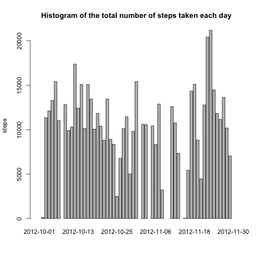
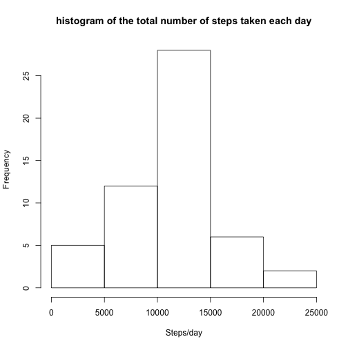
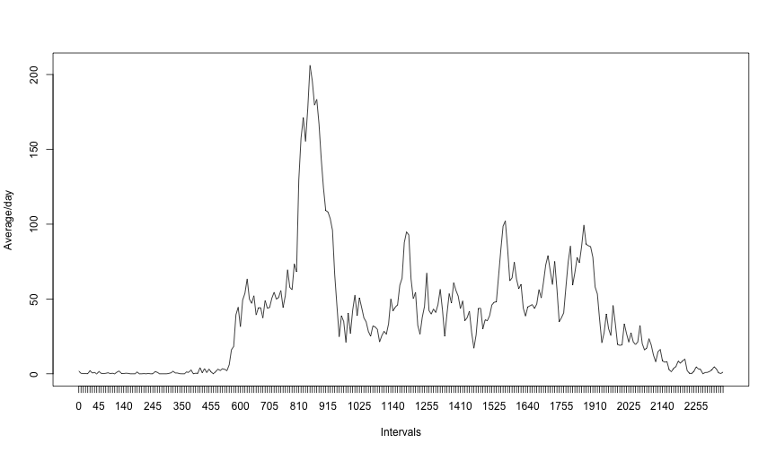
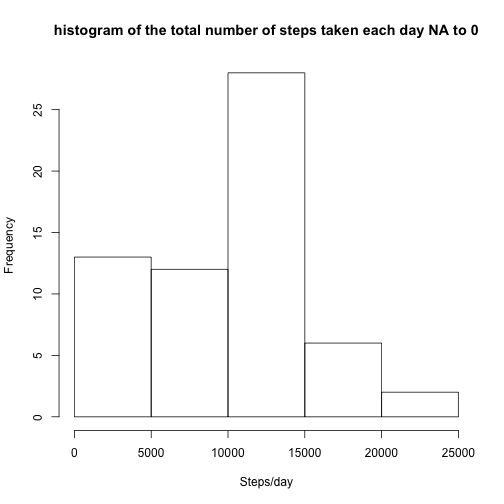
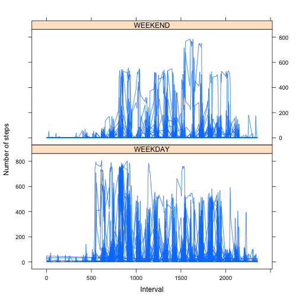

## Loading and preprocessing the data
### 1.Load the data

```r
#Unzip numeric data
unzip("activity.zip",exdir = "numbers")

rawData <- read.csv("numbers/activity.csv")
```

### 2.Process/transform the data (if necessary) into a format suitable for your analysis

```r
#Removing na values (assumming 0)
require(data.table)
activity <- data.table(rawData)
```

## What is mean total number of steps taken per day?
### 1.Calculate the total number of steps taken per day

```r
steps_day <-activity[,list(totalSteps=sum(steps)),by=date]

barplot(steps_day$totalSteps, names.arg=steps_day$date, main="Histogram of the total number of steps taken each day", 	ylab="steps")
```



### 2.Make a histogram of the total number of steps taken each day

```r
hist(steps_day$totalSteps,main="histogram of the total number of steps taken each day",xlab="Steps/day")
```



### 3.Calculate and report the mean and median of the total number of steps taken per day

```r
mean_steps_day <- mean(steps_day$totalSteps,na.rm=TRUE)
# 9354.23
median_steps_day <- median(steps_day$totalSteps,na.rm=TRUE)
# 10395
```

mean: 9354.23

median: 10395


## What is the average daily activity pattern?

### 1.Make a time series plot (i.e. 𝚝𝚢𝚙𝚎 = "𝚕") of the 5-minute interval (x-axis) and the average number of steps taken, averaged across all days (y-axis)


```r
time_interval <- activity[complete.cases(activity),]
time_interval <-time_interval[,list(meanSteps=mean(steps)),by=interval]
plot(x = 1:nrow(time_interval),y = time_interval$meanSteps,type = "l",     xlab="Intervals", ylab = "Average/day", xaxt = "n")
axis(1,labels=time_interval$interval, at = seq_along(time_interval$interval) )
```


  
### 2.Which 5-minute interval, on average across all the days in the dataset, contains the maximum number of steps?

```r
max_interval <- max(time_interval$meanSteps)
time_interval[meanSteps==max_interval,]
```

```
##    interval meanSteps
## 1:      835  206.1698
```

Interval with higher max of steps: 835

## Imputing missing values

### 1.Calculate and report the total number of missing values in the dataset (i.e. the total number of rows with 𝙽𝙰s)

```r
total_na <- sum(is.na(activity$steps))
dim(activity)
```

```
## [1] 17568     3
```

Total na values: 2304
Total values: 17568

### 2.Devise a strategy for filling in all of the missing values in the dataset. The strategy does not need to be sophisticated. For example, you could use the mean/median for that day, or the mean for that 5-minute interval, etc.

The approach would be set to 0 the values that has na


### 3.Create a new dataset that is equal to the original dataset but with the missing data filled in.


```r
#To fill the values we could use something like:
activity2 <- activity
activity2[is.na(activity2)] <- 0
```


### 4.Make a histogram of the total number of steps taken each day and Calculate and report the mean and median total number of steps taken per day. Do these values differ from the estimates from the first part of the assignment? What is the impact of imputing missing data on the estimates of the total daily number of steps?

```r
steps_day_na <-activity2[,list(totalSteps=sum(steps)),by=date]
hist(steps_day_na$totalSteps,main="histogram of the total number of steps taken each day NA to 0",xlab="Steps/day")
```



```r
mean_steps_day_na <- mean(steps_day_na$totalSteps,na.rm=TRUE)
# 9354.23
median_steps_na <- median(steps_day_na$totalSteps,na.rm=TRUE)
# 10395
```

mean: 9354.23

median: 10395

In this case assuming 0 there is no change


## Are there differences in activity patterns between weekdays and weekends?

### 1.Create a new factor variable in the dataset with two levels – “weekday” and “weekend” indicating whether a given date is a weekday or weekend day.


```r
require("timeDate")
activity_weekend <- activity
activity_weekend[, weekend := if ( isWeekend(date) ) "WEEKEND" else "WEEKDAY", by = 1:nrow(activity_weekend)]
```

### 2.Make a panel plot containing a time series plot (i.e. 𝚝𝚢𝚙𝚎 = "𝚕") of the 5-minute interval (x-axis) and the average number of steps taken, averaged across all weekday days or weekend days (y-axis). See the README file in the GitHub repository to see an example of what this plot should look like using simulated data.


```r
activity_weekend_avg <-activity_weekend[,list(totalSteps=sum(steps)),mean.(inte, na.rm=TRUErval, weekend)]
```

```
## Error in eval(expr, envir, enclos): could not find function "mean."
```

```r
library("lattice")
xyplot(totalSteps ~ interval | factor(weekend),
       layout = c(1, 2),
       xlab="Interval",
       ylab="Number of steps",
       type="l",
       lty=1,
       data=activity_weekend_avg)
```




